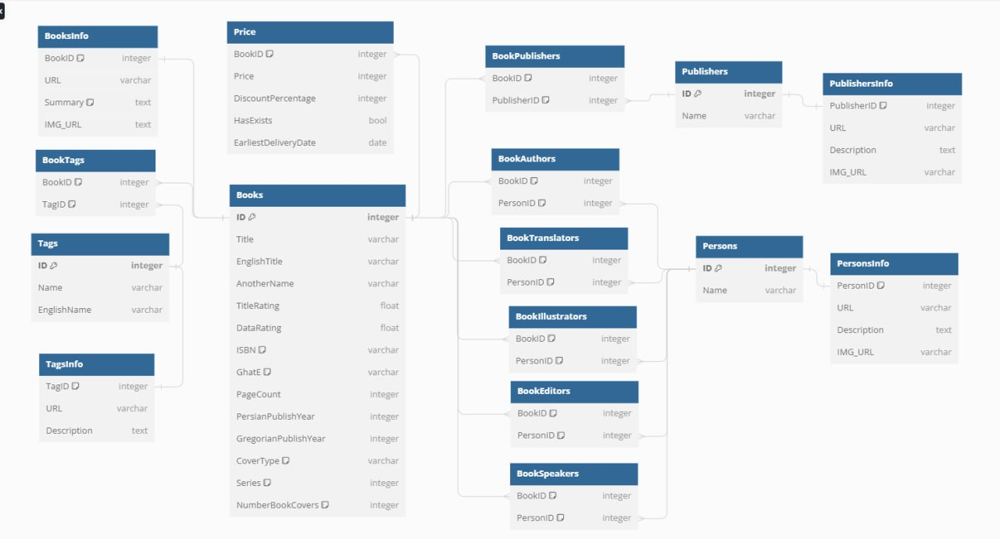

# Quora Data Analysis Bootcamp Project

Welcome to the Quora Data Analysis Bootcamp Project repository! This project aims to extract, analyze, and visualize data related to books from the  [iranketab](https://www.iranketab.ir/) website. It involves a comprehensive approach, including data extraction, database design, dashboard creation, and statistical analysis.

## Project Overview

The primary goal of this project is to build a book bank by extracting and analyzing information about books available on the iranketab website. The project is structured into several phases, including:

1. **Data Extraction:** Extracting and cleaning information from the iranketab website, covering various book attributes such as title, author, price, and more.

2. **Database Design:** Designing a well-structured database to store the extracted information, ensuring optimal normalization and relationships between tables.

3. **Dashboard Development:** Creating an interactive dashboard using Python's Streamlit library to visualize and analyze the data. The dashboard includes analytical charts and advanced search features for users.

4. **Statistical Analysis:** Testing and validating hypotheses related to book attributes, such as the impact of translation on book prices and the price difference between hardcover and paperback editions.

## Features

- **Data Extraction:** Utilizes Python libraries for web scraping and data cleaning to gather book information.

- **Database Management:** A well-designed and normalized database schema for efficient data storage.

- **Interactive Dashboard:** A user-friendly interface for exploring book data, filtering, and conducting advanced searches.

- **Statistical Analysis:** Hypothesis testing and data-driven insights.

## Getting Started

To get started with this project, follow these steps:

1. Clone the repository to your local machine:
git clone The URL

2. Install the required Python libraries:
pip install -r requirements.txt

3. Run the main application:
python main.py

4. Access the dashboard in your web browser at `http://localhost:8501`.

## Contributing

We welcome contributions from the community! If you'd like to contribute to this project, please follow the [contributing guidelines](CONTRIBUTING.md).

## License

This project is licensed under the MIT License - see the [LICENSE.md](LICENSE.md) file for details.

## Acknowledgments

We would like to express our gratitude to the mentors and instructors at Quora Data Analysis Bootcamp for their guidance and support throughout this project.

---

Thank you for your interest in our Quora Data Analysis Bootcamp Project! 

Happy Data Analyzing!

